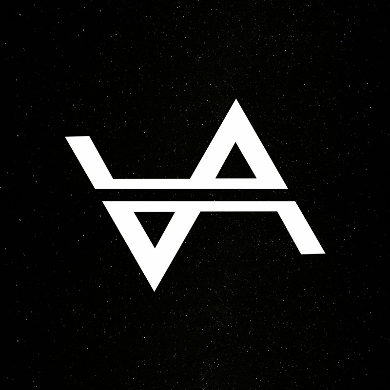

# Voltair Tech - AI Automation Website



## 🚀 About

**Voltair Tech** is Mumbai's premier AI automation and web development agency. This website showcases our cutting-edge AI-powered services including intelligent chatbots, automation solutions, and hyper-realistic AI-generated content.

## ✨ Features

- 🎯 **AI-Powered Chatbot** - Interactive assistant for customer queries
- 🌟 **3D Animated Background** - Three.js particle system with shooting stars
- 🎬 **AI Video Generation** - Showcase of hyper-realistic content creation
- 📱 **Social Media Automation** - LinkedIn, Instagram, Facebook scheduling
- 💼 **Contact Form** - Google Sheets integration via webhook
- ⚡ **Modern UI/UX** - Gold & black theme with smooth GSAP animations
- 📊 **Dynamic Statistics** - Real-time counter animations
- 🔴 **Brand Emphasis** - Red glowing "AI" in VoltAIr Tech

## 🛠️ Technologies Used

### Frontend
- **HTML5** - Semantic markup
- **CSS3** - Advanced animations, gradients, glassmorphism
- **JavaScript (ES6+)** - Vanilla JS for performance
- **Three.js** - 3D graphics and particle effects
- **GSAP** - Smooth scroll-triggered animations
- **Typed.js** - Dynamic text typing effects

### Services Highlighted
- AI Automation
- Custom Chatbots
- Web Development
- Data Scraping
- AI-Generated Videos & Ads
- Social Media Marketing Automation

## 📁 Project Structure

```
voltair-tech/
├── index.html              # Main HTML file
├── css/
│   └── style.css          # All styles and animations
├── js/
│   ├── main.js            # Core functionality
│   ├── chatbot.js         # AI chatbot logic
│   ├── form.js            # Contact form handling
│   ├── three-scene.js     # 3D background effects
│   └── shooting-stars.js  # Dynamic star animations
├── assets/
│   └── images/            # Logo and media files
├── .gitignore
└── README.md
```

## 🚀 Getting Started

### Local Development

1. **Clone the repository**
```bash
git clone https://github.com/harshal-aka-mady/voltair-tech-website.git
cd voltair-tech-website
```

2. **Start local server**
```bash
# Using Python 3
python -m http.server 8000

# Or using Python 2
python -m SimpleHTTPServer 8000

# Or use any static server (Live Server in VS Code, etc.)
```

3. **Open in browser**
```
http://localhost:8000
```

## 🎨 Customization

### Colors
Update CSS variables in `css/style.css`:
```css
:root {
    --gold-primary: #D4AF37;
    --gold-accent: #FFD700;
    --black-bg: #0a0a0a;
}
```

### Contact Form
Update webhook URL in `js/form.js` and `js/chatbot.js` to your Google Apps Script endpoint.

### Logo
Replace `assets/images/voltair-logo.jpg` with your own logo.

## 📱 Contact Information

- **Website**: [Voltair Tech](https://voltairtech.com)
- **Email**: business@voltairtech.com
- **Phone**: +91 7021000764
- **LinkedIn**: [Voltair Tech](https://www.linkedin.com/company/voltairtech)
- **Location**: Mumbai, India

## 🎯 Services Offered

1. **AI Automation** - Streamline business processes
2. **Intelligent Chatbots** - 24/7 customer support
3. **Web Development** - Modern, responsive websites
4. **Data Scraping** - Automated data collection
5. **AI Video & Ad Generation** - Hyper-realistic content
6. **Social Media Automation** - Scheduled posting & engagement

## 📊 Performance

- **Loading Screen**: 1.5s animation
- **Optimized Assets**: Compressed images, minified code
- **Smooth Animations**: 60fps GSAP transitions
- **Responsive Design**: Mobile-first approach

## 🔒 Security

- Form validation on client-side
- Server-side validation via Google Apps Script
- No sensitive data stored client-side
- HTTPS recommended for production

## 📄 License

Copyright © 2026 Voltair Tech. All rights reserved.

## 🤝 Contributing

This is a private portfolio project. For inquiries, contact business@voltairtech.com

## 💡 Future Enhancements

- [ ] Multi-language support
- [ ] Dark/Light theme toggle
- [ ] Blog section
- [ ] Portfolio showcase
- [ ] Client testimonials
- [ ] Case studies

---

**Built with ❤️ by Voltair Tech - Pioneering AI Automation in Mumbai**
